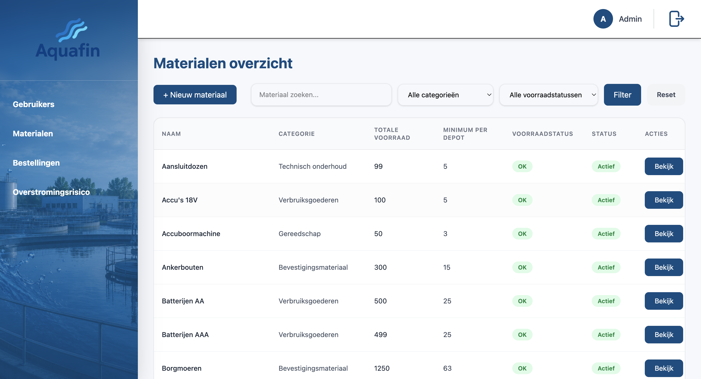
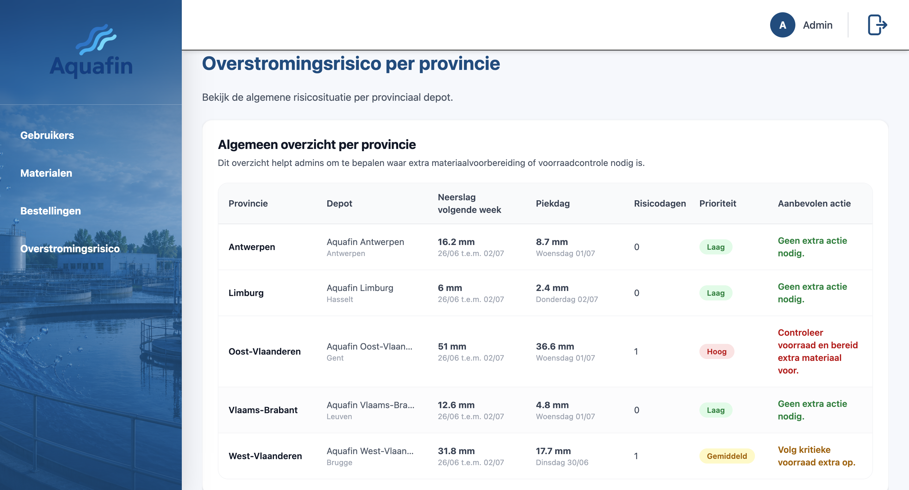
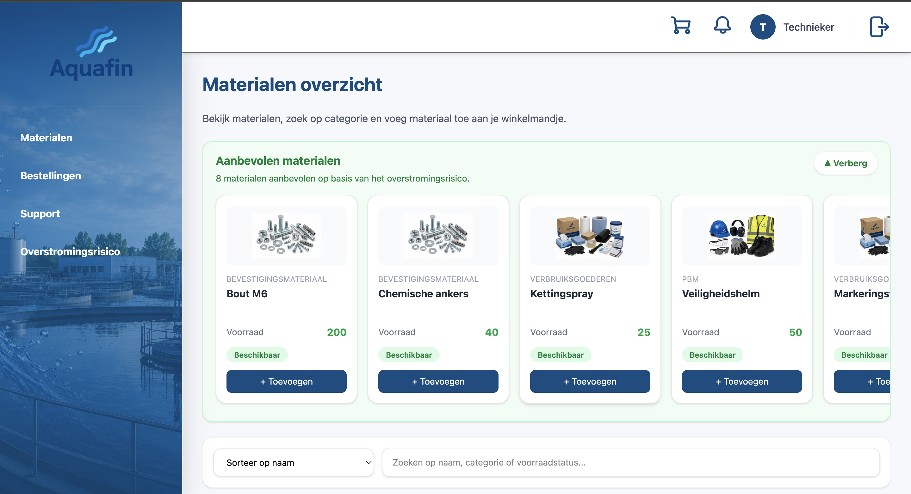
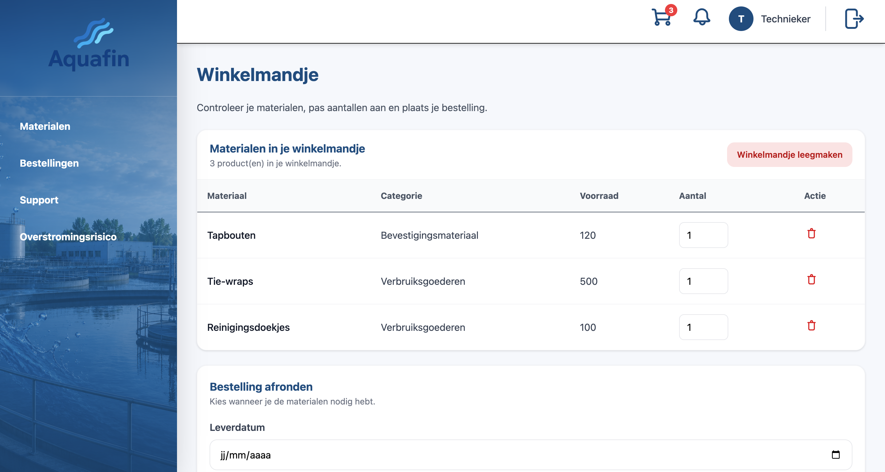
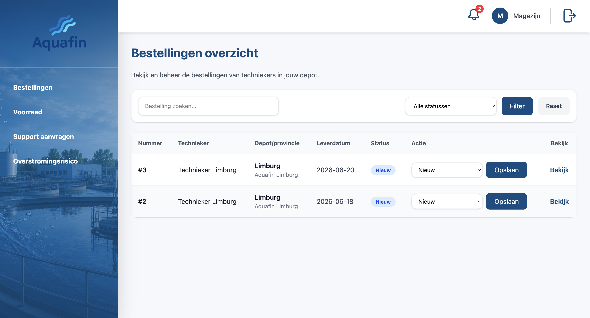
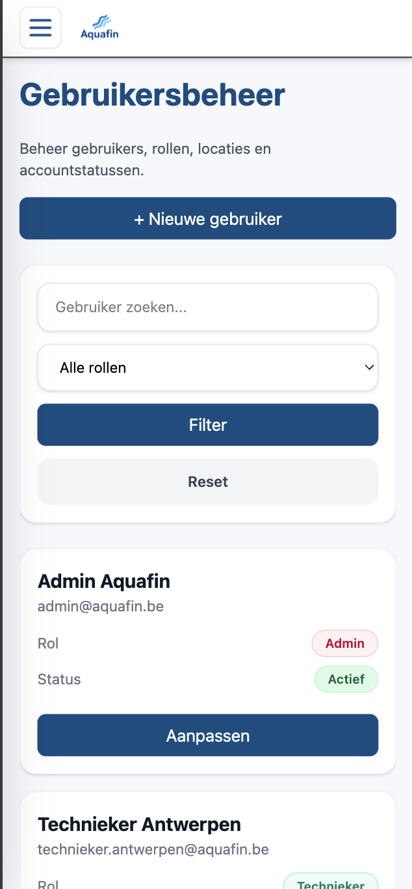
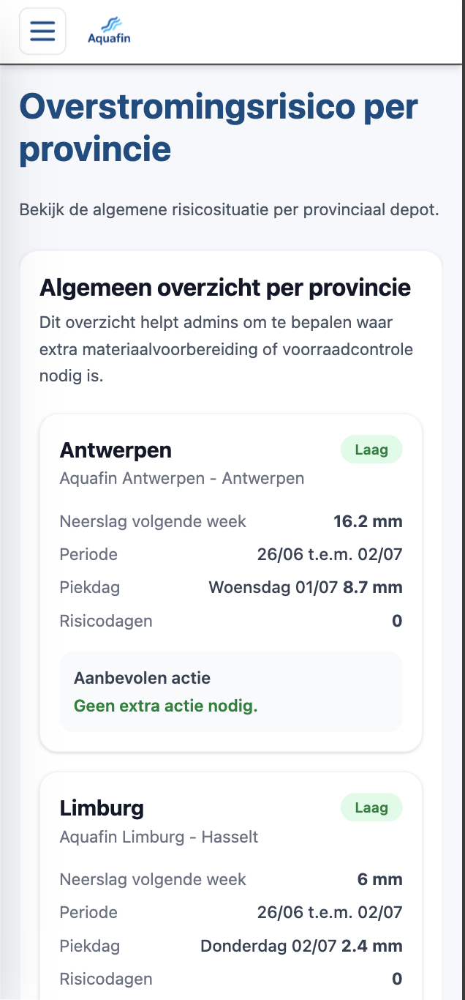
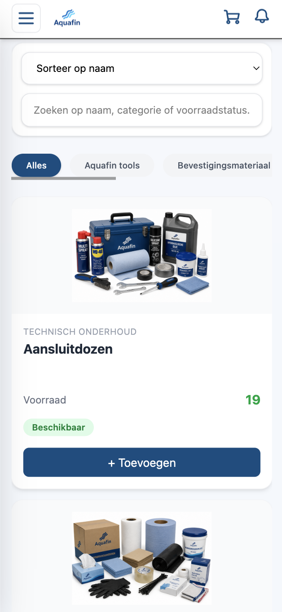

# Aquafin Supply

Aquafin Supply is een Laravel-webapplicatie voor het beheren van materialen, voorraad, bestellingen, supportaanvragen en overstromingsrisico binnen Aquafin.

De applicatie is opgebouwd rond een workflow waarbij techniekers materiaal kunnen bestellen vanuit hun eigen depot, magazijnmedewerkers bestellingen en voorraad opvolgen, en administrators gebruikers, materialen en algemene risico-informatie beheren.

---

## Inhoud

* [Projectbeschrijving](#projectbeschrijving)
* [Screenshots](#screenshots)
* [Gebruikersrollen](#gebruikersrollen)
* [Belangrijkste functionaliteiten](#belangrijkste-functionaliteiten)
* [Overstromingsrisico en aanbevelingen](#overstromingsrisico-en-aanbevelingen)
* [Database-opbouw](#database-opbouw)
* [Technologieën](#technologieën)
* [Installatie](#installatie)
* [Demo-accounts](#demo-accounts)
* [PHPDoc-documentatie](#phpdoc-documentatie)
* [Projectstructuur](#projectstructuur)
* [Notificaties](#notificaties)
* [Zoekfunctionaliteit](#zoekfunctionaliteit)
* [Beveiliging en autorisatie](#beveiliging-en-autorisatie)
* [Responsive design](#responsive-design)
* [Externe bronnen en hulpmiddelen](#externe-bronnen-en-hulpmiddelen)

---

## Projectbeschrijving

Aquafin Supply ondersteunt het logistieke proces rond materiaalbeheer binnen Aquafin.

Het systeem laat toe om:

* materialen centraal te beheren;
* voorraad per depot bij te houden;
* techniekers materiaal te laten bestellen;
* bestellingen automatisch te koppelen aan het juiste depot;
* voorraad automatisch te verminderen bij bestellingen;
* magazijnmedewerkers bestellingen te laten verwerken;
* supportaanvragen tussen techniekers en magazijnmedewerkers te beheren;
* overstromingsrisico’s op te volgen met behulp van weersgegevens;
* materialen aan te bevelen op basis van het berekende overstromingsrisico.

De applicatie gebruikt Laravel MVC met controllers, models, migrations, seeders, Blade views en role-based middleware.

---

## Screenshots

### Desktopweergave

#### Loginpagina


#### Admin - gebruikersbeheer



#### Admin - overstromingsrisico



#### Technieker - materialenoverzicht



#### Technieker - winkelmandje



#### Magazijn - bestellingen



---

### Mobiele weergave

#### Admin - gebruikersbeheer mobiel



#### Admin - overstromingsrisico mobiel



#### Technieker - materialenoverzicht mobiel



---

## Gebruikersrollen

De applicatie ondersteunt drie rollen:

| Rol                | Beschrijving                                                                                |
| ------------------ | ------------------------------------------------------------------------------------------- |
| Admin              | Beheert gebruikers, materialen, locaties, bestellingen en overstromingsrisico’s.            |
| Technieker         | Bekijkt materialen, plaatst bestellingen, volgt eigen bestellingen op en maakt tickets aan. |
| Magazijnmedewerker | Verwerkt bestellingen, beheert voorraad en behandelt tickets voor het eigen depot.          |

---

## Belangrijkste functionaliteiten

### Admin

Een administrator kan:

* gebruikers bekijken;
* nieuwe gebruikers aanmaken;
* gebruikers aanpassen;
* rollen toekennen;
* gebruikers koppelen aan een depotlocatie;
* gebruikers activeren of deactiveren;
* materialen beheren;
* materialen aanmaken, aanpassen en raadplegen;
* materialen activeren of deactiveren;
* afbeeldingen koppelen aan materialen;
* risiconiveaus koppelen aan materialen;
* alle bestellingen bekijken;
* bestellingen filteren op status en depot;
* overstromingsrisico per provincie/depot raadplegen;
* algemene voorraadplanning ondersteunen.

---

### Technieker

Een technieker kan:

* materialen bekijken;
* materialen zoeken via fuzzy search;
* materialen filteren en sorteren;
* voorraad van het eigen depot bekijken;
* aanbevolen materialen zien op basis van overstromingsrisico;
* materialen toevoegen aan het winkelmandje;
* aantallen aanpassen in het winkelmandje;
* materialen verwijderen uit het winkelmandje;
* bestellingen plaatsen;
* eigen bestellingen bekijken;
* bestelgegevens raadplegen;
* supporttickets aanmaken voor bestellingen;
* eigen tickets opvolgen;
* overstromingsrisico voor het eigen depot bekijken;
* notificaties ontvangen;
* een herinneringsmelding krijgen om het gastoestel op te laden en mee te nemen.

---

### Magazijnmedewerker

Een magazijnmedewerker kan:

* bestellingen van het eigen depot bekijken;
* bestellingen verwerken;
* bestelstatussen aanpassen;
* hoeveelheden in bestellingen aanpassen;
* voorraad automatisch laten herberekenen;
* depotvoorraad bekijken;
* materiaalvoorraad opvolgen;
* tickets van techniekers uit hetzelfde depot behandelen;
* ticketstatussen aanpassen;
* magazijnnotities toevoegen;
* notificaties versturen naar techniekers bij wijzigingen;
* overstromingsrisico voor het eigen depot bekijken.

---

## Overstromingsrisico en aanbevelingen

De applicatie gebruikt weersgegevens om overstromingsrisico’s te berekenen.

Hiervoor wordt gebruikgemaakt van de Open-Meteo API. De applicatie haalt neerslaggegevens op voor de locatie van een depot en bepaalt op basis daarvan een risiconiveau.

Mogelijke risiconiveaus:

* Laag
* Gemiddeld
* Hoog

### Technieker

Bij techniekers wordt het overstromingsrisico gebruikt om aanbevolen materialen te tonen.

Materialen kunnen gekoppeld worden aan één of meerdere risiconiveaus. Wanneer het berekende risico bijvoorbeeld `Gemiddeld` is, worden materialen die aan dat risiconiveau gekoppeld zijn als aanbevolen materiaal getoond.

De aanbevelingen zijn gebaseerd op de verwachte neerslag voor de komende 7 dagen.

### Admin

De admin ziet een algemeen overzicht van het overstromingsrisico per provincie/depot. Dit helpt om te bepalen waar extra materiaalcontrole of voorraadvoorbereiding nodig kan zijn.

### Cache fallback

Wanneer de API tijdelijk niet bereikbaar is, kan de applicatie terugvallen op gecachte weersgegevens. Zo blijft de risicopagina bruikbaar, ook wanneer een externe API-call mislukt.

---

## Database-opbouw

De database volgt de workflow van de applicatie.

### Belangrijkste tabellen

| Tabel                 | Doel                                                                                  |
| --------------------- | ------------------------------------------------------------------------------------- |
| `users`               | Gebruikers met naam, e-mailadres, rol, status en gekoppelde locatie.                  |
| `locations`           | Depots/provincies met stad, postcode, latitude en longitude.                          |
| `materials`           | Algemene materiaalgegevens zoals naam, categorie, beschrijving, afbeelding en status. |
| `material_stocks`     | Voorraad per materiaal per depot.                                                     |
| `orders`              | Bestellingen van techniekers.                                                         |
| `order_items`         | Concrete materialen en hoeveelheden binnen een bestelling.                            |
| `tickets`             | Supportaanvragen van techniekers.                                                     |
| `risk_levels`         | Risiconiveaus zoals Laag, Gemiddeld en Hoog.                                          |
| `material_risk_level` | Koppelt materialen aan risiconiveaus.                                                 |
| `user_notifications`  | Notificaties voor gebruikers.                                                         |

### Voorraad per depot

Voorraad wordt niet enkel in `materials` bijgehouden. De echte depotvoorraad staat in `material_stocks`.

Daardoor kan hetzelfde materiaal in verschillende depots een andere voorraad en minimumvoorraad hebben.

Voorbeeld:

| material_id | location_id | stock | minimum_stock |
| ----------- | ----------- | ----- | ------------- |
| 1           | 1           | 50    | 10            |
| 1           | 2           | 20    | 5             |

Wanneer een technieker een bestelling plaatst, wordt de voorraad verminderd in het depot dat gekoppeld is aan die technieker.

---

## Technologieën

Dit project gebruikt:

* PHP;
* Laravel;
* Laravel Breeze;
* Laravel Blade;
* Laravel Middleware;
* Laravel Migrations & Seeders;
* Eloquent Models;
* Tailwind CSS;
* Alpine.js;
* JavaScript;
* Vite;
* MySQL of SQLite;
* Chart.js;
* Open-Meteo API;
* PHPDoc / phpDocumentor.

---

## Installatie

### 1. Repository clonen

```bash
git clone <repository-url>
cd AquafinSupply
```

### 2. Dependencies installeren

```bash
composer install
npm install
```

### 3. Environment-bestand aanmaken

```bash
cp .env.example .env
```

### 4. Applicatiesleutel genereren

```bash
php artisan key:generate
```

### 5. Database instellen

Maak lokaal een database aan en vul de gegevens in het `.env`-bestand in.

Voorbeeld:

```env
DB_CONNECTION=mysql
DB_HOST=127.0.0.1
DB_PORT=3306
DB_DATABASE=naam_van_je_database
DB_USERNAME=root
DB_PASSWORD=
```

De waarde bij `DB_DATABASE` moet overeenkomen met de database die lokaal werd aangemaakt.

### 6. Migraties en seeders uitvoeren

```bash
php artisan migrate:fresh --seed
```

### 7. Storage-link aanmaken

```bash
php artisan storage:link
```

### 8. Frontend starten

```bash
npm run dev
```

### 9. Applicatie lokaal openen

Het project kan lokaal draaien via Laravel Herd of via de Laravel development server:

```bash
php artisan serve
```

---

## Demo-accounts

Demo-gebruikers worden aangemaakt via de seeders in de map:

```text
database/seeders/
```

Na het uitvoeren van:

```bash
php artisan migrate:fresh --seed
```

kunnen de voorziene demo-accounts gebruikt worden om de verschillende rollen te testen.

Controleer de seeders voor de exacte e-mailadressen en wachtwoorden van de demo-accounts.

---

## PHPDoc-documentatie

Voor dit project werd PHPDoc gebruikt om documentatie te genereren op basis van PHPDoc-comments in de code.

De gegenereerde documentatie staat in:

```text
docs/api/
```

De startpagina is:

```text
docs/api/index.html
```

Openen in een browser:

```bash
open docs/api/index.html
```

Opnieuw genereren kan met:

```bash
php phpDocumentor.phar run -d app -t docs/api
```

De documentatie wordt gegenereerd op basis van de code in de map:

```text
app/
```

Belangrijke gedocumenteerde onderdelen zijn onder andere:

* controllers;
* models;
* middleware;
* support classes;
* Blade components in `app/View/Components`.

---

## Projectstructuur

Belangrijke mappen binnen het project:

```text
app/
├── Http/
│   ├── Controllers/
│   │   ├── Admin/
│   │   ├── Auth/
│   │   ├── Technician/
│   │   └── Userzone/
│   ├── Middleware/
│   └── Requests/
├── Models/
├── Support/
└── View/Components/

database/
├── migrations/
├── seeders/
└── factories/

resources/
├── css/
├── js/
└── views/

public/
docs/
```

### Belangrijke controllers

| Controller                      | Doel                                                       |
| ------------------------------- | ---------------------------------------------------------- |
| `UserController`                | Gebruikersbeheer voor admins.                              |
| `MaterialController`            | Materiaalbeheer voor admins.                               |
| `Technician\MaterialController` | Materiaaloverzicht en aanbevelingen voor techniekers.      |
| `Userzone\CartController`       | Winkelmandje van techniekers.                              |
| `Userzone\OrderController`      | Bestellingen van techniekers en magazijnflow.              |
| `TicketController`              | Tickets voor techniekers en magazijnmedewerkers.           |
| `Admin\FloodRiskController`     | Admin-overzicht van overstromingsrisico per depot.         |
| `FloodRiskController`           | Overstromingsrisico voor technieker en magazijnmedewerker. |
| `NotificationController`        | Gebruikersnotificaties.                                    |
| `PasswordChangeController`      | Verplichte wachtwoordwijziging.                            |

---

## Notificaties

De applicatie gebruikt notificaties voor belangrijke gebeurtenissen.

Voorbeelden:

* Nieuwe bestelling geplaatst door een technieker.
* Bestelstatus gewijzigd door het magazijn.
* Nieuwe supportaanvraag aangemaakt.
* Ticketstatus of magazijnantwoord bijgewerkt.

Notificaties worden opgeslagen in de tabel `user_notifications`.

---

## Zoekfunctionaliteit

De applicatie bevat fouttolerante zoekfunctionaliteit via `App\Support\FuzzySearch`.

Deze fuzzy search ondersteunt onder andere:

* zoeken met kleine typefouten;
* zoeken zonder accenten;
* zoeken zonder exacte spaties;
* Levenshtein-afstand;
* zoeken op meerdere relevante velden.

Deze zoekfunctionaliteit wordt gebruikt bij onder andere:

* materialen;
* gebruikers;
* tickets;
* bestellingen.

---

## Beveiliging en autorisatie

De applicatie gebruikt middleware voor rolgebaseerde toegang.

Belangrijke middleware:

| Middleware                | Doel                                                                     |
| ------------------------- | ------------------------------------------------------------------------ |
| `RoleMiddleware`          | Controleert of een gebruiker de juiste rol heeft voor een route.         |
| `EnsurePasswordIsChanged` | Dwingt gebruikers om hun tijdelijk wachtwoord te wijzigen wanneer nodig. |

Voorbeelden van afgeschermde zones:

* Adminpagina’s zijn enkel toegankelijk voor admins.
* Magazijnpagina’s zijn enkel toegankelijk voor magazijnmedewerkers.
* Techniekerpagina’s zijn enkel toegankelijk voor techniekers.
* Gebruikers zien enkel data die relevant is voor hun eigen depot of rol.

---

## Responsive design

De interface is responsive opgebouwd met Tailwind CSS.

Belangrijke responsive keuzes:

* desktopweergave met tabellen;
* mobiele weergave met kaarten;
* responsive sidebar;
* mobiele navigatie met hamburgerknop;
* formulierknoppen full-width op mobiel;
* tabellen vervangen door cards op kleine schermen;
* afbeeldingen worden met `object-contain` getoond om vervorming te vermijden.

---

## Externe bronnen en hulpmiddelen

### AI

AI werd gebruikt als hulpmiddel voor:

* debuggen;
* code-uitleg;
* Laravel-fouten analyseren;
* README en documentatie structureren;
* responsive layout verbeteren;
* PHPDoc-comments aanvullen.

AI werd gebruikt als ondersteuning. De code werd gecontroleerd, aangepast en geïntegreerd door het team.

### Externe API

De applicatie gebruikt de Open-Meteo API voor weersgegevens en neerslagvoorspellingen.

Deze data wordt gebruikt voor:

* berekenen van overstromingsrisico;
* tonen van risicopagina’s;
* aanbevelen van materialen;
* ondersteunen van voorraadplanning.

### Afbeeldingen en branding

De applicatie gebruikt Aquafin-branding en gegenereerde afbeeldingen voor materialen en categorieën.

Deze afbeeldingen werden toegevoegd aan het project om het materiaalbeheer visueel duidelijker te maken. De interface werd afgestemd op het thema van waterbeheer, voorraadbeheer en materiaalvoorziening.
